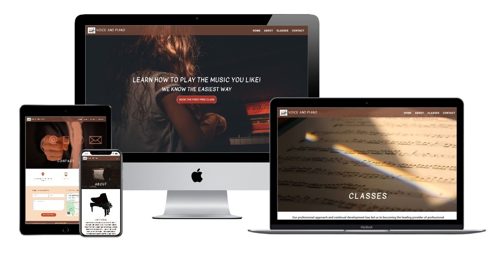
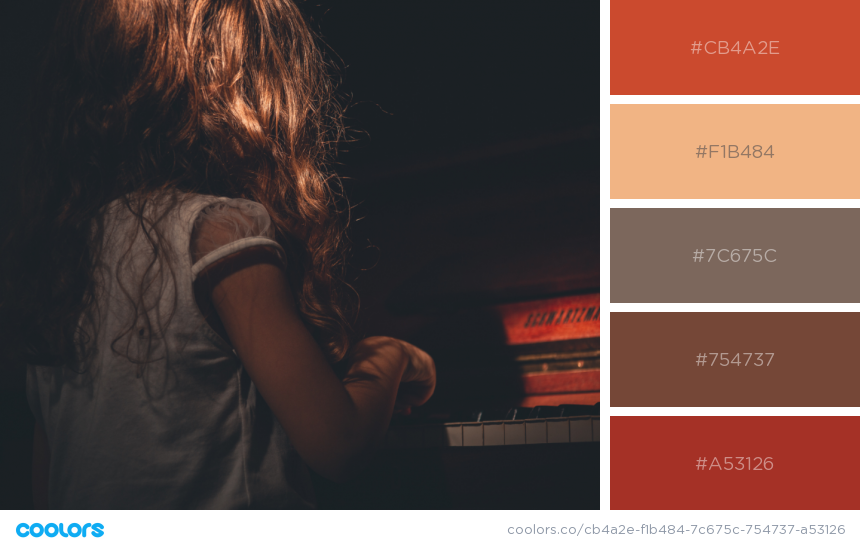

# Milestone 1 - Voice and Piano Music School

This website was created for the first milestone project of Full Stack Developer Course. The project made is a small website for a Music School. 
This website has been built for a good friend, teacher and founder of the Voice and Piano Music School.
The purpose of this project is to create a new modern website, more attractive and functional for her school, which has already an existing own website (https://vocepian.wordpress.com/). 

[Click here to view the project live](https://luizagit.github.io/Voice-and-Piano-MS-1/)

# Table of contents:

 - **[UX](UX)**
    -  **[User stories](#userstories)**
       - [New Users](#new-users)
       - [Business Owner](#business-owner)
    -  **[Strategy](#strategy)**
    -  **[Scope](#scope-plane)**
    -  **[Skeleton](#skeleton)**
    -  **[Surface](#surface)**
 - **[Features](#features)**
   - **[Existing Features](#existing-features)**
    - **[Features left to implement](#Features-left-to-implement)**
 - **[Technologies used](#technologiesused)**
    - **[Additional tools used](#additional-tools-used)** 
 - **[Testing](#testing)**
   - **[Testing on Different Browsers](#testing-on-different-browsers)**
   - **[Testing on Different Devices](#testing-on-different-devices)**
 - **[Deployment](#deployment)**
   - **[Cloning my project](#cloning-my-project)**
 - **[Credits](#credits)**
   - **[Content](#content)**
 - **[Acknowledgements](#acknowledgements)**
 
## UX
The main purpose of the website would be to get people to interest in taking the music classes from this music school. It promotes the positive benefits of learning music to help sell the classes. The website will display the 3 types of classes that they teach: singing, piano and music theory.

### User Stories

##### New users:
* As a user who is thinking about learning a piano or singing, I want to find out information that might convince me to take a class. The option of taking a free trial class would be quite appealing.
* As a user who has already begun learning piano or singing, perhaps I want to find some more formal training, to help me progress, or to add other related skills like music theory.
* As a user who might have children who are interested in music, I want to find out if these classes look appropriate, who the teachers are and where they take place.
* As a user who is thinking about learning the piano or singing, I want to know about the online class options.
* As a user who is thinking to take music classes, I want to know the location of the school so I can attend their classes.
* As a user who is thinking to take music classes, I want to be aware of their values and what makes them unique for the purpose of deciding if they are the best to teach me music classes.
 * As a user who decides to take music classes, I want to access their sign up form in order to register my interest with the school.

##### Business Owner:

* As a owner of the school and want to see the school succeed. I want to clearly display information about upcoming classes in an attractive and informative way, and I want visitors to be able to easily able to contact the school easily.

### Strategy 
I created a moodboard with Adobe Spark (https://spark.adobe.com/)from the research of colors, styles and components to visually illustrate the style I wished to pursue. 
You can see that moodboard [here](design/moodboard.voiceandpiano.pdf)
The following websites were used in the research process for reference and inspiration:
* https://solfeggio.cmsmasters.net/contacts/
* https://www.vivaldimusicacademy.com/
* https://www.playrightmusicltd.com/Piano-Lessons-Dublin/
* http://dublinschoolofmusic.ie/
* https://www.pianosplus.com/blog/piano-news/health-benefits-piano-playing/
* https://www.awwwards.com/

There are 2 main goals of the website:

* to get potential customers to sign up for a class, taking up the option of a free lesson to get a 'taster' for a class. This is probably the main goal.
* to give potential customers information about the music school to entice them to take a class in this school over competitors.

#### Scope plane:
The key features of the website were developed based on user needs. Users should be able to do the following on the website:

* Find out information about classes, content and price
* Learn about the benefits of music
* Booking for a free lesson as a sample.
* View the opinions of other students that have completed the music classes
* Contact the music school 
* Visit social media channels
* Learn more about the music school and its teachers

#### Structure plane
 I grouped the features into four main pages: Home, About, Classes and Contact.
 I wanted the pages to have some consistency, so thought about the homepage hero image, and how the following pages would also start with a header image, which would be shorter than the homepage hero image but following the same pattern. I decided that I didn’t want the images across all devices, except from the hero image of the Home page to cover the full screen because the user would scroll down too much to discover the content of the page.
 
#### Skeleton
 I have included some basic sketching of ideas:
 

 **Initial ideas**
 
- These are initial ideas for the structure of information and pages required, and sketching them down for desktop and mobile on paper as it is quicker.
 - Home Page Desktop version [Here](sketch-wireframes-first_ideas/home-page-desktop-version.jpg)
 - Home Page Mobile version [Here](sketch-wireframes-first_ideas/home-page-mobile-version.jpg)
 - About Page Desktop version [Here](sketch-wireframes-first_ideas/about-page-desktop-version.jpg)
 - About Page Mobile version [Here](sketch-wireframes-first_ideas/about-page-mobile-version.jpg)
 - Classes Page Desktop version [Here](sketch-wireframes-first_ideas/classes-page-desktop-version.jpg)
 - Classes Page Mobile version [Here](sketch-wireframes-first_ideas/classes-page-mobile-version.jpg)
 - Contact Page Desktop and Mobile version[Here](sketch-wireframes-first_ideas/contact-page-desktop-and-mobile.jpg)
 - Structure site [Here](sketch-wireframes-first_ideas/structure-site.jpg)

**Second ideas**
- This formed the basis of my final wireframes, which were created in Figma:
 - Home page [Here](Wireframes-second_ideas/voice-and-piano.home-page.jpg.gz)
 - About Page [Here](Wireframes-second_ideas/voice-and-piano.about-page.jpg.gz)
 - Classes Page[Here](Wireframes-second_ideas/voice-and-piano.Classes-page.jpg.gz)
 - Contact Page [Here](Wireframes-second_ideas/voice-and-piano.contact-page.jpg.gz)

 **Final wireframes** created in Figma
 - Home page [Here](Wireframes-second_ideas/Wireframes-final_ideas/home-pg.png)
 - About Page [Here](Wireframes-second_ideas/Wireframes-final_ideas/about-pg.jpg)
 - Classes page [Here](Wireframes-second_ideas/Wireframes-final_ideas/classes-pg.jpg)
 - Contact page [Here](Wireframes-second_ideas/Wireframes-final_ideas/contact-pg.jpg)

#### Surface

As a starting point I used the image chosen for my landing page which helped to choose the color pallete for the entire website.
Below is a picture of the color palette I got off the website Coolors [https://coolors.co/]

 I used a combination of red, brown and pastel color like peach. 
I decided on this combination because, according to this article [https://99designs.ie/blog/tips/how-color-impacts-emotions-and-behaviors/]:
* Red can also increase a person’s appetite and can develop a passion for something, in this case would be learning apetite.
* Pastel color like peach can also have an uplifting effect on your mood.
* Brown makes you feel down to earth and creates a sense of stability and support. It’s warm and friendly, practical and dependable, and can also represent the old fashioned and well established.

**Typography**
* I used Google Fonts to select the fonts for my project. The Roboto font is the main font used throughout the whole website with Sans Serif as the fallback font in the case for any reason the font isn't being imported into the site correctly. It's a common font and easy to read for the users.
* Kavivanar, cursive is used throughout the whole website for headings to give a smooth look to the website.I thought the cursive Kavivanar is a unique handwriting font and could be related to teaching style handwriting.

 **Imagery**
* The Imagery is very important so I went with a calm and classic style of hero-images to introduce the users to the atmosphere of music and sound. I received inspirations from this site (https://usersnap.com/blog/background-webdesign/)

## Features

### Existing features 
+ The project consists of 4 different pages which can be accessed through the menu in the navbar. All features are responsive on all device sizes.
+ Header Logo - on every page. Acts as a navigation link back to the user's home page.
+ Each page features a responsive navigation bar with conventional placing of logo and brand name (top left).
+ The navigation is made to be fixed at the top so users can jump to any section with the click on the navlinks. Each section details relevant information required to convince users to join music school. The full navigation menu shrinks down to a small menu with a hamburger dropdown menu when on smaller devices i.e phones.
+ Modals - used throughout the site to allow actions to be taken without navigating the user away from the necessary page. In order to help the users to join music school, the webiste provides a sign up form on Pricing packages as well as information convincing the users that Voice and Piano Music School is a great option for people who want to learn or improve music skills.
+ Each page has a footer with information about school, opening hours, contact details and social media links when clicked on, opens out a new tab to the company’s respective social page e.g. their Youtube page. These links are displayed as icons that were taken from Font Awesome.
At the bottom of each page there is a copyright information.

+ The menu at the top of the page and footer are consistent in design and responsiveness 

1.Home page:
+ The navigation bar is what the user first encounters on the Home page laptop/desktop or a navbar with a hamburger menu on mobiles.
 + The users are greeted with a hero image - a girl singing at piano that can be viewed in full screen and they soon understand the purpose for this webpage.
  Also, the users can see a banner text and call to action button for booking the first free class by having it fill out the contact form on the Contact page.
+ A welcome message
 + Three reasons to choose this music school
 + Cards with music classes images offered by the school, on these cards the users can click on a button which links to the classes page with classes details
 + The benefits of learning piano music - the user can find some details about big advantages of learning piano
 + Testimonials -  the user can view some opinions from previous students experiences clicking on the carousel lines 

2.About page:
 + The mission of the school- info about school
 + Three reasons to choose this music school (the same like on Home page)
 + The teachers cards with a hover effect allows users to view the teachers and find their qualifications and their social media links (blanks). This section is laid out in columns of cards, 1 column wide for mobile devices and 3 columns wide for tablets and desktop.
 + A gallery from the last event organised for children by the Music School- the gallery section is laid out in columns of cards images, 1 column wide for mobile devices, 2 columns wide for tablets and 3 columns wide for desktop.

3.Classes page:
 + The types of classes within jumbotron, at the bottom of each jumbotron a button which links to the contact form.
 + The pricing Packages feature four tables - the tables are displayed next to each other on desktop and tablet, and stacked two top of other two for mobiles and Ipad Pro.
 + At the bottom of each table, there is a button which opens a sign up modal form.

4.Contact page:
+ contact details - the address and contact details of the school
+ contact - form with submit form allows users contact the school, by having them fill out the contact form (the modal opens and gives a feedback to users)
+ the school location is marked on a map so users can quickly see where the school is located

### Features Left to Implement
- Send Email to link the Contact form by email JS so that the user can send a quick message to the admin/owner of the website
- Add JS to allow for the sign up form to actually be submitted and back-end to allow for user-data to be stored.
- Video lessons
- A button for translation into Romanian language, most of the users would be romanians
- A newsletter page could be ideal for users to sign up to and increase the social aspect of the website

## Technologies Used

* HTML5 - used for the structure the content of the website.
* CSS3 - used to style  most of the elements on the page such as: fonts, color, spacing, positioning, some of the responsiveness etc.
* [Bootstrap](https://getbootstrap.com/)-  used to help for the responsive grid layout, navbar, modals, carousel, and forms.
* [GitHub](https://github.com/) - used to create and host the repository
* [Git](https://git-scm.com/) for version control
* [Gitpod](https://www.gitpod.io/)- used as my IDE to develop the project
* [JQuery](https://jquery.com/)- to simplify DOM manipulation
* Chrome DevTools used for responsiveness on different media sizes
* [GoogleFonts](https://fonts.google.com/)  - to import the font-family used in the website
* [FontAwesome](https://fontawesome.com/)- all Icons were taken from the Font Awesome database.

### Additional tools used
* [W3C Markup Validation Service](https://jigsaw.w3.org/css-validator/) - used to run all CSS code through and see if there are any errors in it
* [HTML Validator](https://validator.w3.org/)- used to run all HTML code through and see if there are any errors in it
* [Code Beautify CSS beautifier](https://www.freeformatter.com/css-beautifier.html) - used to make my CSS look nicer and tidier
* [Code Beautify HTML](https://webformatter.com/)- used to make my HTML tidier
* [Autoprefixer](https://autoprefixer.github)-used to add vendor prefixes to my CSS
* [Am I Responsive tool](http://ami.responsivedesign.is/) for the image used in the UX section showing the different screen sizes.
* [Favicon Generator](https://realfavicongenerator.net/) - used to make the favicons
* [Tinypng](tinypng.com )- used to compress my image files to try to reduce the loading time for each page
* [Editor markownn language text](https://dillinger.io) - used to write ReadMe
* [Figma](https://www.figma.com/) for wireframes
* [Techsini](https://techsini.com/)for mockup

## Testing

1. Google Chrome, Internet Explorer, Firefox, Opera & Microsoft Edge - were used to view the site in different browsers.
2. Chrome DevTools - was used generously for styling and spacing and also viewport screens. I had issues with cards on mobile and Ipad screens being unequal than the screen and this was easily fixed by giving the cards elements an explicit height .

 **Navigation bar link**:

- Launch the Voice and Piano website to display its homepage on screen.
- If on a mobile or tablet screen, click the hamburger icon in the top right hand corner, for the dropdown menu of the website's different sections. If on a laptop or desktop monitor, access the menu on the menu links located in the top right hand.
- Click on each menu link one by one.
- Check that clicking on the link sends the user to the respective section of the website without leaving the Voice and Piano website.

**Testimonials**:

- Open the Voice and Piano website Home page
- Scroll down to the testimonials section
- Make sure that the images of the people and their opinions are showcased clearly across the user’s screen by clicking on the each line within carousel

**Pricing tables**:
- Open the Voice and Piano website - Classes page
- Scroll down to the Pricing Section that shows the pricing packages
- Ensure all of them are clearly visible to the user
- Click on each sign up button that appears on each pricing package, one by one, and check if the sign up form for the selected package, as a modal, openes.

**Social media icons**:
- Open the Voice and Piano website - Classes page
- Scroll down to the footer or to the bottom of teachers cards
- Click on each social media icon one by one.
- Verify that clicking on each of these icons, opens up a new tab to the homepage of their respective website.
- Ensure the current website isn’t lost or changed during this process so the user can find their way back to it.

**Contact form** :
- Open the Voice and Piano website - Contact page
- Click on each contact detail icons one by one and verify if another tab openes for making a call or sending an e-mail.
- Try to submit the form and verify that a modal form appears.

**Validating the Code**:
- HTML I validated the HTML with the W3C Markup Validation Service (https://validator.w3.org/)
- CSS I validated the CSS with the W3C CSS Validation Service (https://jigsaw.w3.org/css-validator/)

Validation Results:
Links to the results of the last validation completed can be found below:

**HTML**
- Home Page - [An Error Found](Validation-results/INDEX-HTML-VALIDATION.JPG) *attribute "ride" not allowed on div element at this pont**, which was solved 
- About page - [No Errors Found](Validation-results/ABOUT-HTML-VALIDATION.JPG)
- Classes page - [No Errors Found](Validation-results/CLASSES-HTML-VALIDATION.JPG)
- Contact page - [No Errors Found](Validation-results/HTML-CONTACT-VALIDATION.JPG)

**CSS**
-[A parse error](Validation-results/style.css-validation.JPG) which was solved.

#### Testing on Different Browsers
I manually tested the website and worked fine as expected on the following browsers:

* Chrome
* Opera
* Mozilla Firefox
* Microsoft Edge

#### Testing on Different Devices
I sent the website link to my friends and family members, so the website was tested on the following devices:

* Iphone 5
* Samsumg S8
* Iphone 11
* Iphone 11 Pro,
* Huawei P20
* Galaxy J7
* Lg G6

This website has been tested through the ,
This website has been tested through the GTMetrix site, (https://gtmetrix.com/GTmetrix). Below is a screenshot of the results achieved. Page speed score was 75% and the time to fully load the site was 2.5s.
[gtmetrix result](Validation-results/gtmetrix.jpg)

## Deployment

This project was developed in GitPod and deployed to the hosting platform GitHub Pages.
I took the following steps to deploy the **Voice-and-Piano-MS-1** through to GitHub Pages:

* Loaded GitHub in Chrome web browser and signed in Clicked on My Repositories Navigated to  Selected Settings
* Scrolled down to the GitHub Pages area of the page Selected ‘Master Branch’ from the ‘Source’ dropdown menu 
* Confirmed my selection **Voice-and-Piano-MS-1** is now on GitHub Pages [live](https://luizagit.github.io/Voice-and-Piano-MS-1/)

## Cloning my project
If you would like to work on my project further you can clone it to your local machine using the following steps:

* Scroll to the top of my repository and click on the "clone or download button"
* Decide whether you want to clone the project using HTTPS or an SSH key and do the following:
  * HTTPS: click on the checklist icon to the right of the URL
  * SSH key: first click on 'Use SSH' then click on the same icon as above
* Open the 'Terminal'
* Change the current working directory to the location where you want the cloned directory
* Type 'git clone', and then paste the URL you copied earlier.
* Press 'Enter' to create your local clone.
* You can find both the source of this information and learn more about the process on the following link: Cloning a Repository

## Credits
- [Code Institute](https://codeinstitute.net/)
- https://www.w3schools.com https://www.w3schools.com/html/html5_semantic_elements.asp
- https://getbootstrap.com/docs/4.3/layout/grid/
- https://getbootstrap.com/docs/4.4/components/navbar/
- https://getbootstrap.com/docs/4.2/components/carousel/
- https://www.w3schools.com/howto/howto_css_pricing_table.asp
- https://mdbootstrap.com
- https://stackoverflow.com/
- https://www.youtube.com/ - general resource

### Content

  The photos used in this site were obtained from the below sites except from those photos from Gallery section which were obtained from Voice and Piano Music School Facebook Page. (https://www.facebook.com/vocesipian/)
*  https://www.pexels.com/
*  https://unsplash.com/
*  https://pixabay.com/

The text content was adapted from original website (https://vocepian.wordpress.com/). 

### Acknowledgements
- Code Institute for the course material and their inspiration from challenges and mini projects.
- I would like to give a thank you to my mentor Seun Owonikoko for all the help and advice he has given throught the milestone.